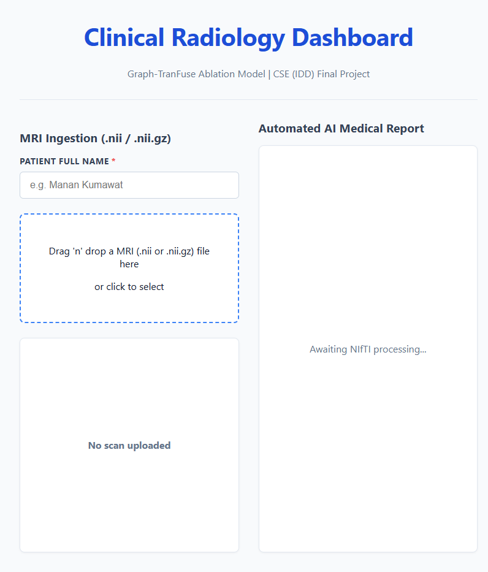

# AAHN Clinical Dashboard



This repository contains the full-stack clinical web interface for our ablation study on the **Asymmetric Adaptive Heterogeneous Network (AAHN)** for multi-modality medical image segmentation. Built with a React frontend and a FastAPI/PyTorch backend, this platform ingests raw 3D BraTS NIfTI volumes, executes automated neuroepithelial segmentation using our customized AAHN engine, and leverages the Google Gemini Large Language Model to synthesize structured, printer-ready clinical radiology reports.

### 🔗 Core Engine Repository

The main model training, ablation study code, and supercomputer/HPC scripts can be found here:

- **Graph-TranFuse Ablation Engine:** [JianMoGuBeiChen/AAHN-Ablation-Study](https://github.com/JianMoGuBeiChen/AAHN-Ablation-Study)

---

## ✨ Key Features

- **MRI Volume Ingestion:** Drag-and-drop interface specifically built for native 3D `.nii` and `.nii.gz` format scans.
- **Automated AI Inference:** Direct integration with the PyTorch backend to generate segmentation masks and calculate precise tumor volumes ($mm^3$).
- **Clinical Report Synthesis:** Translates raw numerical matrices into structured, Markdown-formatted radiological insights using the Gemini API, acting under strict medical constraints.
- **Medical-Grade PDF Export:** A custom `html2pdf.js` pipeline that captures a high-resolution, Day Mode clinical document complete with patient demographics and timestamps.

---

## 🛠️ Tech Stack

- **Frontend:** React.js, Vite, Custom CSS (Day Mode Clinical Theme), `react-markdown`, `html2pdf.js`
- **Backend:** FastAPI, Python, PyTorch, `nibabel` (for NIfTI processing)
- **LLM Integration:** Google Gemini API

---

## 🚀 Local Setup Instructions

### 1. Backend Environment (FastAPI)

Navigate to your backend directory and set up a Python virtual environment:

```bash
python -m venv venv
source venv/bin/activate  # On Windows use: venv\Scripts\activate
pip install -r requirements.txt
```

**Model Weights Requirement:**
Before running the server, you must provide the trained PyTorch model weights. Run the training pipeline in the companion [AAHN-Ablation-Study](https://github.com/JianMoGuBeiChen/AAHN-Ablation-Study) repository to generate your `best_model.pth` file. Place this file directly into the root of your backend directory.

**Note:** If the weights file is missing, the system defaults to a **Mock Analysis Mode** for demonstration purposes.

**Environment Variables:**
Create a `.env` file in the root of your backend directory and add your Gemini API key:

```env
GEMINI_API_KEY=your_secret_key_here
```

**Start the Server:**

```bash
uvicorn main:app --reload --port 8000
```

### 2. Frontend Environment (React/Vite)

Navigate to your frontend directory:

```bash
npm install
npm run dev
```

The dashboard will be available at `http://localhost:5173`.

---

## 📋 Sample Output: Clinical AI Report Prototype

The following is a prototype of the automated radiology report generated by the AAHN Clinical Dashboard when processing a multi-parametric MRI volume.

> ### EXAM: MRI BRAIN (AUTOMATED AI VOLUMETRIC ANALYSIS)
>
> **CLINICAL INDICATION:**
> Automated segmentation and volumetric characterization of neuroepithelial tissue.
>
> **TECHNIQUE:**
> Multi-parametric automated inference performed via Graph-TranFuse neural network. Analysis utilizes native NIfTI volume data to perform voxel-wise classification of tumor sub-regions.
>
> **QUANTITATIVE FINDINGS:**
>
> - **Peritumoral Edema:** 110.0 mm³
> - **Necrotic Core:** 71.0 mm³
> - **Enhancing Tumor:** 152.0 mm³
> - **Total Calculated Lesion Burden:** 333.0 mm³
>
> **RADIOLOGICAL IMPRESSION:**
> Automated volumetric analysis reveals a complex lesion demonstrating an active enhancing tumor component (152.0 mm³) with associated peritumoral edema (110.0 mm³) and a necrotic core (71.0 mm³), totaling a lesion burden of 333.0 mm³. The presence of both significant peritumoral edema and central necrosis is indicative of a complex and potentially aggressive pathological process.
>
> _*** PRELIMINARY AI-GENERATED REPORT - FOR ACADEMIC/RESEARCH USE ONLY ***_

---

**[📄 Click here to view the Full Radiology Report Prototype](./Manan_Kumawat_Radiology_Report.pdf)**

## 📄 License & Attribution

**Frontend & API Interface:** The web dashboard code in this repository is licensed under the [MIT License](LICENSE).

**Base Architecture Disclaimer:** The underlying Asymmetric Adaptive Heterogeneous Network (AAHN) architecture utilized in the companion ablation repository is based on the original published research. The modifications, web integration, and ablation logic were developed solely for academic research and educational purposes as part of a university final project.
